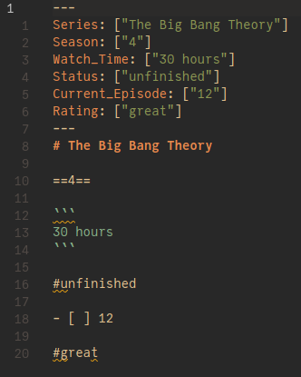

# CSV to Markdown converter

This script converts every row of all CSV files in the working directory and subdirectories into Markdown files according to the formatting settings you choose per column.

This will ***not*** create a Markdown table.

**It is still in early alpha, so please have backups!** At this stage I may still introduce features that will break existing saved settings. When you update, you may need to update them/do the configuration again.

**The encoding with which the files will be opened is UTF-8. Make sure that your CSV files are in that encoding, otherwise they might get screwed up. Again, please have backups**.

I have tested it with Python 3.9.4. (Because I use typing the Python version needs to be at least 3.5, I haven't checked for the other imported packages.)

The Markdown syntax is supposed to support the full range of Markdown formatting which is available within Obsidian. Therefore, it supports some non-standard formatting, which may not work with every Markdown editor.

## Usage

Clone this repo and put the CSV files you want to convert in the same directory.

Run `csv_to_md-file.py` in the terminal *from the directory in which these files are located*.

It will prompt you for your choices.


The outputted Markdown files will appear in the `./data/` subdirectory. (No need to create it, the program takes care of it.)

As example one of the outputted Markdown files (with the example CSV file and settings from the GIF) looks like this:



You can try it out with different settings with the example CSV file. (Not included so that you don't have to delete it every time you pull again to update, just copy the contents below in a CSV file and run the script.)

```csv
Series,Season,Watch_Time,Status,Current_Episode,Rating
How I met your Mother,2,20 hours,unfinished,2,good
The Big Bang Theory,4,30 hours,unfinished,12,great
Black Mirror,2,10 hours,unfinished,1,fantastic
```

## Options

You can:

- add everything as YAML frontmatter
- only write the contens of the CSV files as inline YAML (instead of having the contents as frontmatter YAML and/or Markdown)
- choose the delimiter of your CSV files
- the maximum file name length
- from which column the file name should be generated
- choose the Markdown formatting for each column
- write the chosen settings to `saved_settings.py`
- read settings you set before.

File name collisions are handles by appending `_<number>` to the file name.

## How it works

It will let you choose the settings for the first file in the list of CSV files the program creates, so all the CSV files you run it on have to have
the same columns if you want the settings to be applied consistently/if you want it not to fail. (This means that you should only run the script on CSV files with the same number of rows/formatting at once and choose different settings for the next batch.)

`saved_settings.py` is not yet created, but will be. That way your settings won't be overwritten when you `pull` to update. All subsequent saved settings will be appended to this file.

## Example settings

Breaking change 2021/05/13: If you have existing settings from before this version, you will need to surround the corresponding value of 'fileNameCol' with square brackets.

If you choose to add frontmatter YAML, you cannot add inline YAML.
Your choice for inline YAML will have now effect in that case.
If you only want to have inline YAML, select no for fronmatter YAML and yes for inline YAML.
When you select yes for inline YAML, only inline YAML will be added to the file
(but the values will be with Markdown formatting).

```python
save2 = {'addYAML': 'n',
 'column': {0: ['h2'],
            1: ['ul'],
            2: ['ta'],
            3: ['ta', 'y', ','],
            4: ['oc'],
            5: ['ml'],
            6: ['ta'],
            7: ['ut'],
            8: ['ut']},
 'delimiter': ',',
 'fileNameCol': [0, 1],
 'fileNameColSeparator': ' -- ',
 'fileNameLength': 50,
 'inlineYAML': 'y'}
```


## Remarks for manually editing the settings

You can create them manually as well/edit them after using the script.

'fileNameColSeparator' is not needed, if there is only one element in 'fileNameCol'. 'inlineYAML' is only needed when you
don't choose to add frontmatter YAML. If you let the script take care of everything, you don't need to worry about it.